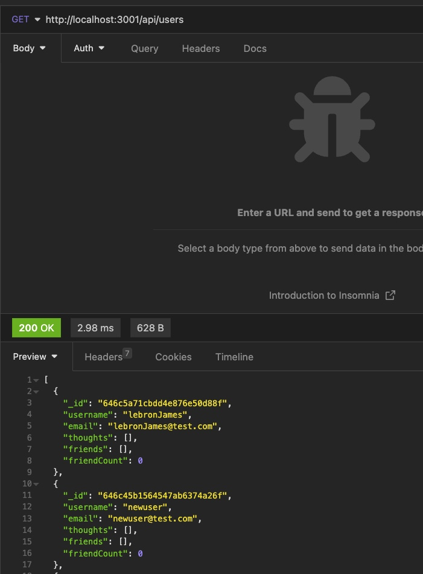

# social-network-api

## Technology Used 

| Technology Used         | Resource URL           | 
| ------------- |:-------------:| 
| Git | [https://git-scm.com/](https://git-scm.com/)     | 
| Node.js | [https://nodejs.org/api/cli.html](https://nodejs.org/api/cli.html)   |
| NPM | [https://www.npmjs.com/](https://www.npmjs.com/)   |
| Mongoose | [https://mongoosejs.com/](https://mongoosejs.com/)   |
| MongoDB | [https://www.mongodb.com/](https://www.mongodb.com/)   |
| Insomnia | [https://insomnia.rest/download](https://insomnia.rest/download)   |
| Express | [https://expressjs.com/](https://expressjs.com/)   |


## Description 

 Walkthrough Video [https://drive.google.com/file/d/16pVxK5P_fE41twtLfKr5mzJDYlGAQq5T/view]

This program is an API containing information on a database for a social network site. Users can reference the data via Insomnia, in which they can see information on Users info such as their thoughts, reactions, and friends list. They can also add to data as well.


## Table of Contents 

* [Javascript Example](#javascript-example)
* [Usage](#usage)
* [Learning Points](#learning-points)
* [Author Info](#author-info)


## Javascript Example

To get a hold of this project, simply navigate to my Github profile and select the repo "social-network-api". From there copy the SSH link into your terminal, Gitbash, or whatever application you prefer and use git copy and then paste the link. You can then open it using VS Code and run it using node and view it in Insomnia.


```javascript
   createUser(req, res) {
    const { body } = req;
    User.create(body)
      .then((dbUserData) => res.json(dbUserData))
      .catch((err) => res.status(500).json({ error: "An error occurred" }));
  },

```

In the above code, I set up the ability to create a new user, if there is a problem a 500 error code is sent.

```javascript

router.route("/").get(getAllUsers).post(createUser);

router.route("/:id").get(getUserById).put(updateUser).delete(deleteUser);

router.route("/friends/:userId/:friendId").post(addFriend).delete(removeFriend);
  
```

These are routes to create a new user, find specific users and update or delete them, and the route to add and remove friends.


## Usage 
To use the social network API, you must first acquire it through GitHub, see above how to do this. After you open it in VS Code, you may then use your computer's terminal or the terminal in VS Code. Make sure you are inside this repository in the terminal, and run "npm install" and the then "npm start". Then open up Insomnia to view, add, update, or delete data. To find the correct routes to do this, please refernce the walkthough video or look into the thoughts and user.js files in the api folder.


</br>

</br>


## Learning Points 


Through this project, I got more experience using Insomnia and more experience with make get, post, put, and delete requests using mongoose and mongoDb. 

## Author Info


### Sam Higa 


* [Portfolio](https://samhiga.github.io/my-portfolio/)
* [LinkedIn](https://www.linkedin.com/in/sam-higa-b887b9209/)
* [Github](https://github.com/samhiga)